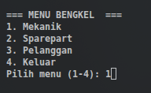
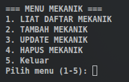
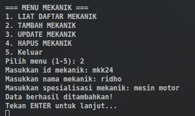
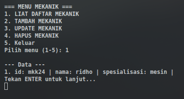
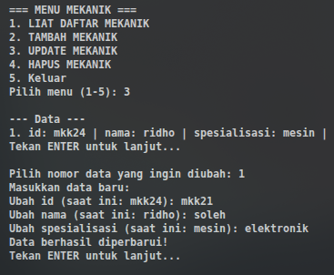
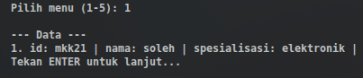
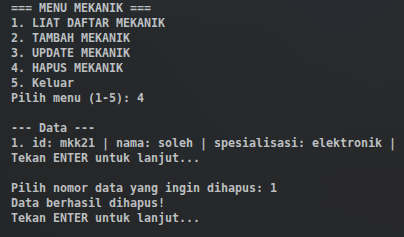
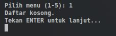
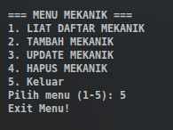
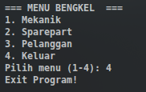

# Laporan Posttest 1 

Proyek ini adalah aplikasi manajemen data bengkel sederhana menggunakan bahasa pemrograman Java dengan konsep **Object-Oriented Programming (OOP)**. Aplikasi ini memungkinkan pengelolaan data Mekanik, Sparepart, dan Pelanggan melalui operasi CRUD (Create, Read, Update, Delete) yang diimplementasikan secara dinamis menggunakan *Java Reflection*.

## Identitas
- **Nama**: Ridho
- **NIM**: 2409106029

---

## Deskripsi Program
Program ini dirancang untuk mengelola tiga jenis entitas utama di sebuah bengkel:
1. **Mekanik**: Mengelola ID, nama, dan spesialisasi mekanik.
2. **Sparepart**: Mengelola ID, nama, dan harga suku cadang.
3. **Pelanggan**: Mengelola nama pelanggan, jenis kendaraan, dan keluhan.

Keunggulan program ini adalah penggunaan **Generic Method** dan **Java Reflection** pada kelas `Crud.java`, sehingga logika penambahan, penampilan, pembaruan, dan penghapusan data dapat digunakan kembali untuk berbagai jenis *class* (objek) tanpa menulis ulang kode yang sama.

---

## Struktur Folder
Sesuai dengan konfigurasi VS Code, struktur folder proyek ini adalah sebagai berikut:
- `src/`: Berisi kode sumber Java (.java).
    - `Crud/*`: Package untuk logika utama CRUD.
    - `Crud/Helper.java`: Package untuk program pendukung seperti clear screen.
    - `Main.java`: Kelas utama yang berisi definisi objek dan alur program.
---

## Implementasi Fitur

### 1. Create (Tambah Data)
Menambahkan objek baru ke dalam `ArrayList` secara dinamis. Program akan mendeteksi field dari kelas yang bersangkutan dan meminta input kepada pengguna.

### 2. Read (Tampilkan Data)
Menampilkan seluruh data yang tersimpan dalam `ArrayList`. Jika daftar kosong, program akan memberikan notifikasi.

### 3. Update (Ubah Data)
Mengubah data yang sudah ada berdasarkan nomor urut. Program menampilkan nilai lama sebelum meminta pengguna memasukkan nilai baru.

### 4. Delete (Hapus Data)
Menghapus data tertentu dari `ArrayList` berdasarkan indeks nomor yang dipilih pengguna.

---

## Alur Program
### 1. Menu Utama
  
Misal pilih menu mekanik

### 2. CRUD di menu mekanik
  
disini akan dicontohkan menggunakan menu Mekanik:
- Tambah Mekanik (Create)
- Liat Daftar Mekanik (Read)
- Update Mekanik (Update)
- Hapus Mekanik (Delete)

1. Tambah Mekanik  

2. Liat Daftar Mekanik  

3. Update Mekanik  
  

4. Hapus Mekanik  
  

5. Keluar  
  
